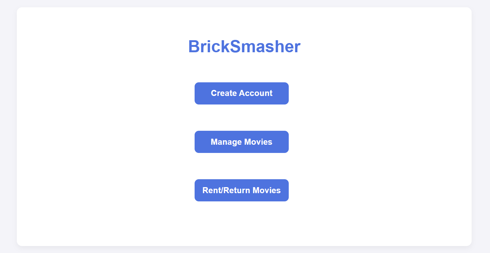

# BrickSmasher

BrickSmasher is a Django-based movie rental management system designed to revive the nostalgia of renting movies on VHS tapes. This software helps store employees manage the rental experience, including account creation, managing movie stock, and renting/returning movies.


<p align="center">
  
</p>


## Table of Contents

- [Installation](#installation)
- [Usage](#usage)
- [Project Structure](#project-structure)
- [Pages](#pages)
- [API Endpoints](#api-endpoints)
- [Models](#models)

## Installation

### Prerequisites

- Python 3.8 or higher
- Django 5.0.2 or higher

### Setup

1. Clone the repository:

    ```bash
    git clone https://github.com/dssushruth2000/BrickSmasher-Movie-Rental.git
    cd BrickSmasher-Movie-Rental
    ```

2. Create a virtual environment:

    ```bash
    python -m venv venv
    ```

3. Activate the virtual environment:

    - On Windows:
      ```bash
      .\venv\Scripts\activate
      ```
    - On macOS/Linux:
      ```bash
      source venv/bin/activate
      ```

4. Install the dependencies:

    ```bash
    pip install -r requirements.txt
    ```

5. Apply migrations:

    ```bash
    python manage.py migrate
    ```

6. Run the development server:

    ```bash
    python manage.py runserver
    ```

7. Open your browser and go to `http://127.0.0.1:8000/`.

## Usage

The application provides the following functionalities:

- Create accounts for new members.
- Manage movie inventory.
- Rent and return movies.

## Pages

- **Home** (`""`): The home page with links to other pages.
- **Account Creation** (`"account/"`): Page to create a new account.
- **Manage Movies** (`"movie/"`): Page to manage movie inventory.
- **Rent/Return Movies** (`"rent/"`): Page to rent or return movies.

## API Endpoints

- **Manage Users** (`"dbUser/"`):
  - `GET`: Expects an email. Returns the user object associated with that email.
  - `POST`: Expects an email, first name, and last name. Creates a user in the database with the given info.

- **Manage Movies** (`"dbMovie/"`):
  - `GET`: Returns an array of all movie objects.
  - `POST`: Expects an action ("new", "add", "remove"). Handles movie management actions.

- **Manage Rentals** (`"dbRent/"`):
  - `GET`: Returns an array of all movie checkouts.
  - `POST`: Expects user ID, movie ID, and action ("rent", "return"). Handles movie rental actions.

## Models

- **User**: Represents a user with fields for first name, last name, and email.
- **Movie**: Represents a movie with fields for title and in-stock quantity.
- **Checkout**: Represents a rental transaction linking a user and a movie.

## Contributing
Contributions to the Elixir project are welcome. Please feel free to fork the repository and submit pull requests.

